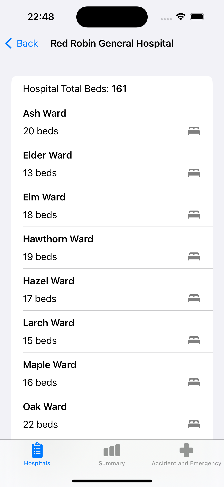
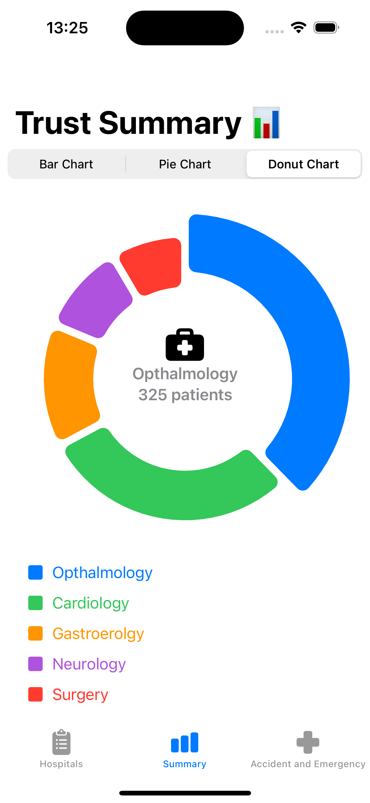

# Hospital Charts App

An app to try out the **Charts** framework

The hospitals in this app are fictitious data used for the charts is generated at random 

- iOS 17 Chart features
- Hospitals Wards Stats
- Departments overview number of patients seen

## Home Screen & Acute Hosptials Screens

    
    
    
        

## Community Hospitals Screens

    
    
    

## Summary of the Trust Screen

    
    
   

### A and E Screen

    
    
    
    
   

